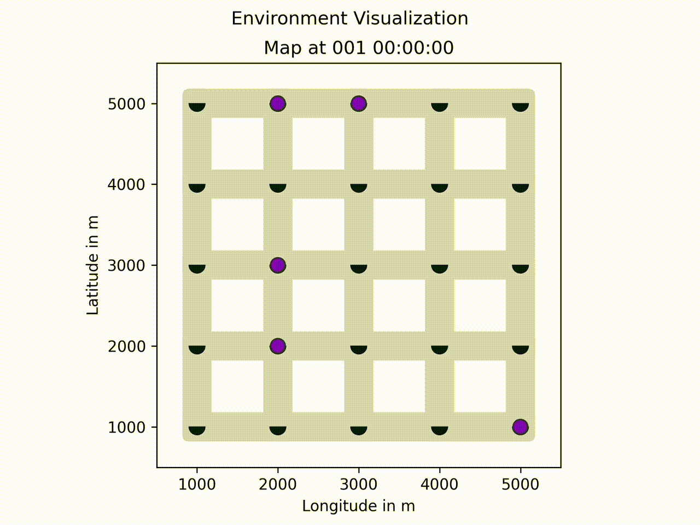
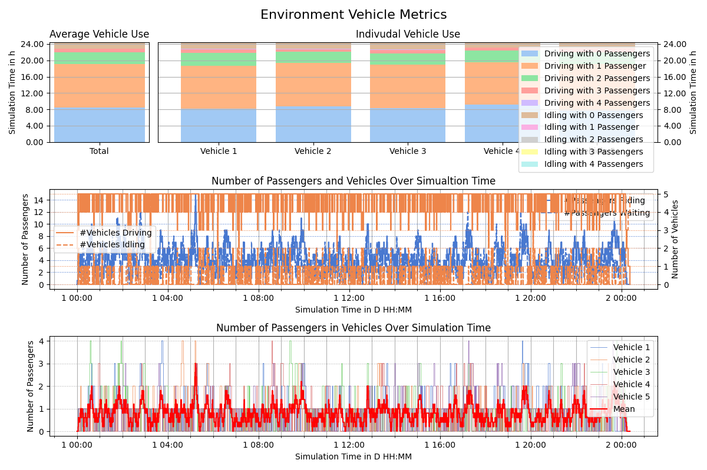
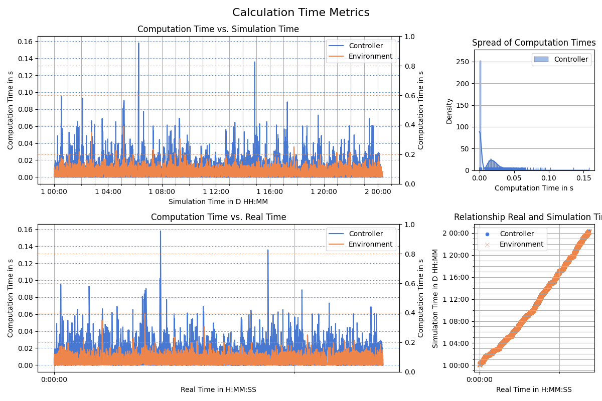

Simulate **On-Demand Ride-Sharing Problems** aka. a Dial-A-Ride Problem (DARP) with ride-requests not known in advance!

Written in `python3.11` as an event-based simulation. It is extensible in the sense that different environments as well as controllers can be added as well as the core functionality extended. It has been developed by @dPozharski and @birawaich for a project in the course [Advanced Topics in Control](https://www.vvz.ethz.ch/Vorlesungsverzeichnis/lerneinheit.view?semkez=2025S&ansicht=ALLE&lerneinheitId=188429&lang=en) at ETHZ in spring semester 2025.

# Sample Output

Running 24h on a 5x5 Grid (`BieleGrid`) with 5 vehicles with a capacity of 4 and an expected 2 passenger requests per grid node per hour (distributed uniformly) using our standard passenger assignment controller `NovelTaxiController` together with the rebalancing controller `RebalancingController`.

  
15min of simulation time.

Next to (optional) verbose output, an (optional live) visualization, metrics for passengers, vehicles, as well as computation times are returned. See below for samples.





Depending on the controller, more plots might be returned.

# Setup Guide

## Python Setup: Linux
```
git clone git@github.com:birawaich/on-demand-ride-sharing_simulator.git
cd on-demand-ride-sharing_simulator
python3.11 -m venv venv
source venv/bin/activate
pip install -r requirements.txt
```

## Running Application

Entry Point: `simulation/run_simulation.py`

Note comments in the source file. Per default 24h of the `BieleGrid` environment are simulated. To run the more time-intensive `ManGrid` (Manhattan for the [NYC Taxi Set](https://www.nyc.gov/site/tlc/about/tlc-trip-record-data.page)) read the comments in the entry point file.

## Repository Organization

# Architecture

The simulation is an **event-driven** simulation. An Environment (e.g. `Bielegrid`, inheriting from `Environment`) can be asked for the next event (calling `next_event()`) and receives an event as well as the corresponding time-stamp in simulation time. This event can then be handled (or ignored) by a controller. The controller (inheriting from `Controller`) interacts with the environment by sending an action (calling `register_action()`). The environment validates the action.

The **environment** keeps track of states. It contains an event queue and the state of all vehicles and passengers. It is further responsible for the (live) visualization and measuring of values for the metrics as well as plotting these.

The **controller** either keeps track of states through information upon initialization or reads from the environment. As this is python this practice has to be done with care, not to edit the internal environment states.

The spatial information is in a **geography** class (inheriting from `Geography`). Spatial information refers to the underlying map, (shortest) trajectories and their durations. A controller and a environment usually share a geography. The geography does not keep state.

## Events & Actions

See `simulation/event.py` for all event types. Note that only `RideRequest`, `PickupDropoff`, `ControllerTimingTick` are communicated outside of the environment.

There is only one action simply called `Action`. It allows the controller to set vehicle state and vehicle plans.

### Typical Flow of Event and Action for a single passenger

`[e]` ... event, `[a]` ... action

```
+ [e] ride request
+-[a] assign request to vehicle by moving vehicle to this place
      this creates internally a VehicleArrival event in the future
+ [e] vehicle arrival --> succesful pickup at location
+-[a] continue with driving
+ [e] vehicle arrival --> succesful dropoff at location
+-[a] continue with driving
```

## Controllers

Multiple controllers are implemented.

- `IndecisiveController` ... testing controller, does not do ride-sharing but randomly changes the route of a different vehicle. Used to test changing route of driving vehicles (works).

## Limitations

# Development Notes

## UUIDs everywhere!

## Custom Controllers and Environments

## Code Quality

# License

See the [LICENSE](LICENSE) file for license rights and limitations (AGPL).