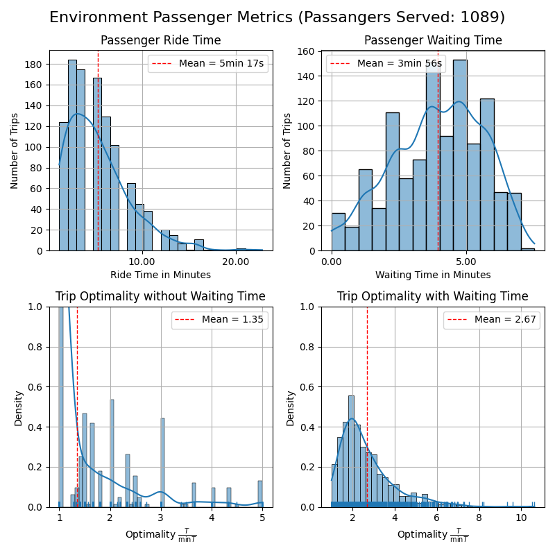

Simulate **On-Demand Ride-Sharing Problems** aka. a Dial-A-Ride Problem (DARP) with ride-requests not known in advance!

Written in `python3.11` as an event-based simulation. It is extensible in the sense that different environments as well as controllers can be added as well as the core functionality extended. It has been developed by [@dPozharski](https://github.com/dPozharski) and [@birawaich](https://github.com/birawaich) for a project in the course [Advanced Topics in Control](https://www.vvz.ethz.ch/Vorlesungsverzeichnis/lerneinheit.view?semkez=2025S&ansicht=ALLE&lerneinheitId=188429&lang=en) at ETHZ in spring semester 2025.

## Problem Description

(Skip if you know what DARP is) The problem solved is described colloquially as follows:

At any time some passenger P at some location A may decide that location B would be much more enjoyable to be at than its current location A. Unfortunately, there is no public transport from A to B and it is a tidbit far to walk or cycle. Passenger P decides to use a ride-sharing service for the journey: instead of a taxi, where one only share the vehicle with the driver, in a ride-sharing service further passenger may jump on and off on P's route that either share P's fascination for location B or may head to a different location C. Through using this service P hopes to pay less than for a conventional taxi and do something good for the environment. The thought of how convenient it would be to own a car briefly crosses P's mind. P argues that if the waiting time and ride time is not too bad, such a ride-sharing service is the more convenient solution.

Our core objective is to ensure that passengers like P enjoy their ride-sharing experience. We do this by smartly assigning available vehicles to the passengers' ride requests, in our example P wanting to got from A to B at time t. We command a fleet of vehicles with a certain capacity each that roam the city. This assignment is done the controller. In less colloquial literature this is known as the Dial-A-Ride Problem (DARP). Everything around it as keeping track of vehicles and which passengers fancy which locations is done by the environment. Our passengers do not plan ahead and only submit their ride request at the very time when they decide that their current location is the less favorable one compared to the destination location. Hence we cannot plan in advance, this is what we mean by "on-demand".

# Sample Output

Running 24h on a 5x5 Grid (`BieleGrid`) with 5 vehicles with a capacity of 4 and an expected 2 passenger requests per grid node per hour (distributed uniformly) using our standard passenger assignment controller `NovelTaxiController` together with the rebalancing controller `RebalancingController`.

  
15min of simulation time.

Next to (optional) verbose output, an (optional live) visualization, metrics for passengers, vehicles, as well as computation times are returned. See below for samples.




Depending on the controller, more plots might be returned.

# Setup Guide

## Python Setup: Linux

```
git clone git@github.com:birawaich/on-demand-ride-sharing_simulator.git
cd on-demand-ride-sharing_simulator
python3.11 -m venv venv
source venv/bin/activate
pip install -r requirements.txt
mkdir out, data
```

In words: clone the repo, install the requirements via pip, make the two directories `out` and `data` to access data and place output.

## Running Application

Entry Point: `simulation/run_simulation.py`

Note comments in the source file. Per default 24h of the `BieleGrid` environment are simulated. To run the more time-intensive `ManGrid` (Manhattan for the [NYC Taxi Set](https://www.nyc.gov/site/tlc/about/tlc-trip-record-data.page)) read the comments in the entry point file and download the dataset and place it into `data/`, we used data from 2013-05-13 resulting in `data/trip_data_050513_050513.csv`.

## Repository Organization

-   `simulation/` ... folder containing source files for the simulation  
    It contains both the "core" files as well as other files. With core files we refer to  e.g. `eventqueue.py` required by the code independent of what environment or geography is loaded. Other files are the different environments and controllers as well as postprocessing files (`postprocessing_*` and `results_post`). Latter were used for the project submission.
-   Outside of this main folder are more source files:  
    -   `playground_rebalancing.py` offers function to numerically test convergence of the static case (= no acting main    controller) of the rebalancing controller.
    -   The two `sample_*.py` scripts show how we used [osmnx](https://github.com/gboeing/osmnx) to pull data from [OSM](https://www.openstreetmap.org/)

# Architecture

The simulation is an **event-driven** simulation. An Environment (e.g. `Bielegrid`, inheriting from `Environment`) can be asked for the next event (calling `next_event()`) and receives an event as well as the corresponding time-stamp in simulation time. This event can then be handled (or ignored) by a controller. The controller (inheriting from `Controller`) interacts with the environment by sending an action (calling `register_action()`). The environment validates the action.

The **environment** keeps track of states. It contains an event queue and the state of all vehicles and passengers. It is further responsible for the (live) visualization and measuring of values for the metrics as well as plotting these.

The **controller** either keeps track of states through information upon initialization or reads from the environment. As this is python this practice has to be done with care, not to edit the internal environment states.

The spatial information is in a **geography** class (inheriting from `Geography`). Spatial information refers to the underlying map, (shortest) trajectories and their durations, and region (incl. generation) if required. A controller and a environment usually share a geography. The geography does not keep state.

All computations are centralized in the sense that no different processes are spawned to simulate different computational units.

## Events & Actions

See `simulation/event.py` for all event types. Note that only `RideRequest`, `PickupDropoff`, `ControllerTimingTick` are communicated outside of the environment.

There is only one action simply called `Action`. It allows the controller to set vehicle state and vehicle plans.

### Typical Flow of Event and Action

`[e]` ... event, `[a]` ... action  
Scope: for a single passenger without ride-sharing

```
+ [e] ride request
+-[a] assign request to vehicle by moving vehicle to this place
      this creates internally a VehicleArrival event in the future
+ [e] vehicle arrival --> succesful pickup at location
+-[a] continue with driving
+ [e] vehicle arrival --> succesful dropoff at location
+-[a] continue with driving
```

## Controllers

Multiple controllers are implemented.

-   `NovelTaxiController`  
    An efficient ride-sharing controller that uses a 2-opt local search to optimize vehicle routes based on a detailed cost function, assigning new ride requests to the best available vehicle. Works with local information and hence could be run distributed.  
    Note: the name is a bit misleading, as it is neither for Taxis nor a complete novel idea. It however was our novel controller compared to the existing controllers that built on the taxi controllers.
-   `RebalancingController`  
    A controller spatially distributing capacity by scheduling around idling vehicles without passengers. Implements a quantized gossiping algorithm. Could be run distributed but requires regions.  
    Does not work on its own and needs to be deployed with a `CombinedController`, favorably combined with the `NovelTaxiController`.
-   _Testing Controllers_
    -   `RandomTaxiController`  
        Does not do ride-sharing. Assigns any random vehicle (regardless whether they carry a passenger currently or their backlog) to an incoming-ride requests. Used to do initial testing.
    -   `NearestTaxiController`
        Does not do ride-sharing. Assigns the closest available free vehicle to a request. Used for testing and a crude implementation of a FCFS strategy.
    -   `IndecisiveController`  
        Does not do ride-sharing. Works like `RandomTaxiController` and additionally randomly changes the route of a different vehicle. Presumably due to the indecisiveness of the taxi driver or for some sightseeing side quest. Used to test changing route of driving vehicles.
    -   `MultiplePassengerController`  
        Does ride-sharing. Assigns the vehicle that passes by closest to the pickup location of the request and insert the passenger accordingly. Do not attempt to get better routes by shuffling the order in which (future) passengers hop on or are dropped off. Works as a (low) baseline for ride-sharing.

## Environments and Geographies

Two environments with corresponding geographies are implemented:

-   `BieleGrid`  
    A simple n by n grid without correspondence to any real environment. Ride request are generated such that in expectation they are uniform in time and space.  
    The corresponding geography `BieleGridGeography` computes a distance matrix from any grid location to any other and computes trajectories using A*. Nodes are assumed to be 1km apart and vehicles travel 50km/h.  
    This environment is used for testing.
-   `ManGrid`  
    It represents the Manhattan, USA area. Ride requests are taking from the [NYC Taxi Set](https://www.nyc.gov/site/tlc/about/tlc-trip-record-data.page). Note that it takes quite some time to generate this environment due to the geography, we recommend generating it once and then storing it.  
    The corresponding geography `ManGridGeography` uses the graph stored at `man_graph_prune.graphml`, extracted from [OSM](https://www.openstreetmap.org/) with [osmnx](https://github.com/gboeing/osmnx). Distances (which are measured in time given the underlying OSM speed limit information) can be precomputed (=what takes time).  
    This environment is used for evaluation against other algorithms.

## Limitations

-   We silently assume that the controller is fast enough: simulation time does halt while the controller computes its action. As a remedy use the computational time metrics to justify this simplification.
-   No u-turns: Vehicles may not turn around between locations. This is significant in case locations are separated by long-to-traverse streets. As a remedy, locations to bisect said streets can be inserted.  
    Note that in code sometimes the term "hotswapping" is used. This referes to a vehicle driving from A to B along the location sequence (A,2,3,4,5,B). With hotswapping the vehicle change destination B  somewhere along this trajectory, however due to no u-turns if let's say the vehicle is between 3 and 4 during a change the vehicle must first reach location 4 before adjusting the trajectory.
-   Passenger boarding times are neglected. Vehicles further do not slow down. We assume everyone is in a constant hurry. As we are residing in Zurich, we find this a viable assumption.

In general, the simulation does not take anything into account outside of the problem specification that one might expect in a real-life environment such as varying traffic patterns, congestion, car breakdown, ...

Lastly, many limitations can be more or less easily changed by modifying the source code. E.g. while we assume constant capacity of vehicles, each vehicle already has its own capacity field. Or uncertainty due to traffic can be added by the durations drawn by the environment being pulled through a Gaussian.

# Development Notes

First of all, recall that this code was written for a course project of a course that was _not_ about how to do simulations _nor_ about how to write python but advanced topics in control. While we tried to remain clean (e.g. doctype comments, not accessing private fields, removing legacy code) we most probably did not succeed everywhere.

Python was picked as it is fast to prototype and has amazing libraries.

## UUIDs everywhere!

One first notice that somebody loves UUIDs! UUIDs are used to denote passengers, vehicles, locations, regions - just anything that needs and ID. The reasoning behind this is to be able to pass information between different classes without having to expose internal objects or painstakingly write data transfer classes.

## Custom Controllers and Environments

To implement custom controllers and environments, best look how the previous ones are implemented. Do not take the interfaces (e.g. `Geography` or `Environment`) as static. We changed them along the way during development as well.

If you get completely stuck, raise an issue. Or if you know us, just reach out directly!

## Code Quality

If you read up until here, you most definitely also have noticed that there is no unit-tests. Code was verified on the go (a bad practice) and there is a minefield of assertions throughout. And there are doctype comments for at least most of the core functionality (which is the majority of the code).

Ideally the `simulation` folder would be accessed like a package. However, we use class fields as settings (as a substitution for beloved C macros) and we did not figure out/invest time in how file resolution works in python.

So in case you want to expand on this code base significantly, start with packaging files and writing unit tests. Through that you will also fully understand the codebase ;)

# License

See the [LICENSE](LICENSE) file for license rights and limitations (AGPL).